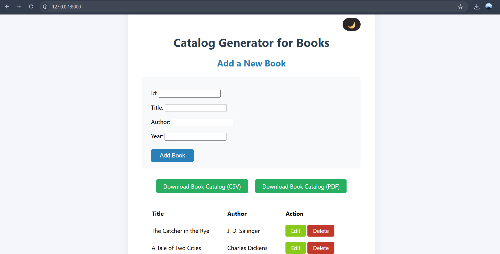
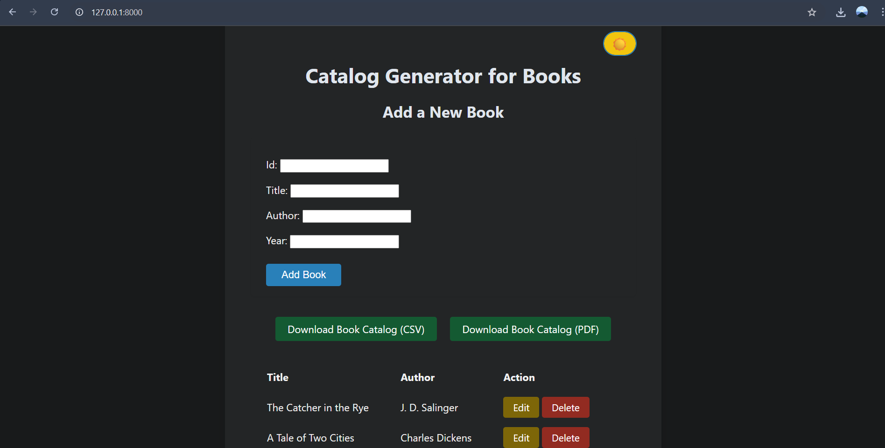
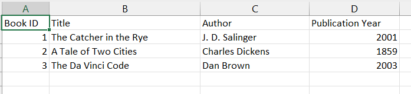
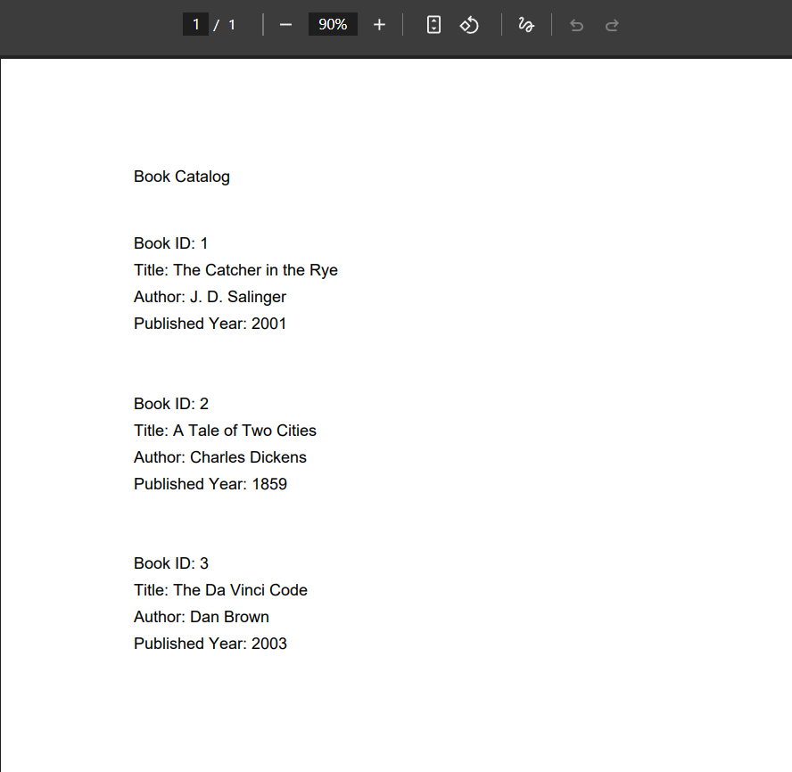
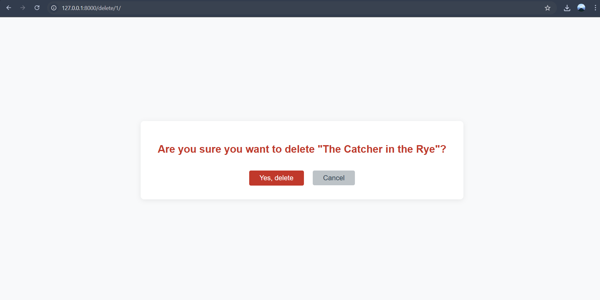
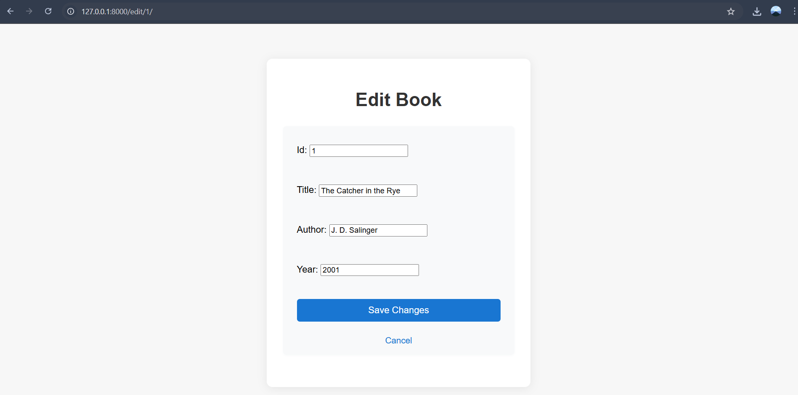

# Book Catalog Generator

A Django web application to manage and generate a catalog of books. Add, edit, and delete books, and download your catalog as CSV or PDF. Features a modern UI with light/dark mode.

## Features

- Add, edit, and delete books (ID, title, author, year)
- Download catalog as CSV or PDF
- Responsive UI with light/dark mode toggle

## Screenshots









## Getting Started

### Prerequisites

- Python 3.8+
- pip

### Installation

1. **Clone the repository:**
   ```sh
   git clone https://github.com/yourusername/book-catalog-generator.git
   cd book-catalog-generator
   ```

2. **Create and activate a virtual environment:**
   ```sh
   python -m venv venv
   # On Windows:
   venv\Scripts\activate
   # On macOS/Linux:
   source venv/bin/activate
   ```

3. **Install dependencies:**
   ```sh
   pip install django reportlab
   ```

4. **Apply migrations:**
   ```sh
   python manage.py migrate
   ```

5. **Run the development server:**
   ```sh
   python manage.py runserver
   ```

6. **Open your browser and go to:**
   ```
   http://127.0.0.1:8000/
   ```

## Usage

- Add a new book using the form.
- Edit or delete existing books.
- Download the catalog as CSV or PDF.
- Toggle light/dark mode with the button in the top right.

## Project Structure

- [`catalog_generator/`](catalog_generator/) - Django app (models, views, forms, templates, static)
- [`project/`](project/) - Django project settings and configuration
- [`example_images/`](example_images/) - Example screenshots
- [`manage.py`](manage.py) - Django management script

## Customization

- To change book fields, edit [`catalog_generator.models.Book`](catalog_generator/models.py).
- To modify the UI, edit templates in [`catalog_generator/templates/`](catalog_generator/templates/) and CSS in [`catalog_generator/static/`](catalog_generator/static/).

## License

This project is licensed under the MIT License. See the [LICENSE](LICENSE) file for details.

---